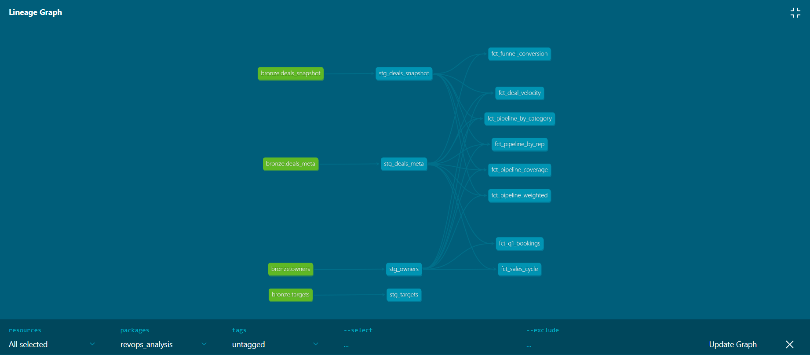

# Innovatech RevOps Analysis
### Lean Layer Analytics Engineer Case Study
**Prepared by:** Kushali Darak | **Date:** April 2026

---

## The Brief

Innovatech is a 50-person SaaS company. Their CRO came to us with three questions:

1. *"We missed Q1 bookings by 18% — what blew the forecast?"*
2. *"Where are deals stalling and why?"*
3. *"Given today's pipe, are we on track for next quarter?"*

This repository contains the full analytics engineering solution built to answer those questions.

---

## What I Built

Rather than just writing a few SQL queries, I built a production-grade data pipeline that mirrors how a real RevOps team would tackle this problem:
Raw CRM Data (CSV)
↓
Google Cloud Storage (Data Lake)
↓
BigQuery Bronze (Raw tables — untouched)
↓
dbt Transformations
↓
BigQuery Silver (Cleaned and standardized)
↓
BigQuery Gold (Business-ready analytics models)
↓
Looker Studio (Executive dashboard)

---

## The Data

Four source files simulating CRM exports:

| File | Rows | Description |
|---|---|---|
| owners.csv | 13 | Sales rep metadata |
| deals_meta.csv | 700 | Deal-level attributes |
| deals_snapshot.csv | ~8,300 | Weekly pipeline snapshots |
| targets.csv | 104 | Quarterly booking targets |

---

## Tech Stack & Why

| Tool | Role | Why This Tool |
|---|---|---|
| Google Cloud Storage | Data Lake | Serverless, cost-efficient, native GCP integration |
| BigQuery | Data Warehouse | Pay-per-query, no cluster management, native Looker Studio connector |
| dbt Core | Transformation | Industry standard for analytics engineering, SQL-based, version controlled |
| Looker Studio | BI Dashboard | Free, native BigQuery connector, sufficient for executive dashboards |
| GitHub | Version Control | All transformation logic version controlled and reviewable |

> **Note:** Snowflake and AWS Redshift are equally valid alternatives. Architecture decisions should always align with the client's existing infrastructure. GCP was selected here for its serverless model and cost efficiency at this data volume.

---

## Data Architecture — Medallion Pattern

### Bronze Layer (Raw)
Exact copy of source data. Never modified. Always replayable.

| Table | Description |
|---|---|
| deals_meta | Raw deal attributes |
| deals_snapshot | Raw weekly pipeline snapshots |
| owners | Raw sales rep data |
| targets | Raw quarterly targets |

### Silver Layer (Cleaned)
dbt staging models that clean, standardize and enrich the raw data.

| Model | What It Does |
|---|---|
| stg_deals_meta | Type casting, null handling, adds is_won / is_lost / is_open flags |
| stg_deals_snapshot | Adds is_latest_snapshot, is_q1_2025, is_q2_2025 flags |
| stg_owners | Adds is_active flag, calculates tenure, flags departed reps |
| stg_targets | Flags exponential growth as data quality issue |

### Gold Layer (Business Ready)
dbt mart models that directly answer the CRO's questions.

| Model | Answers |
|---|---|
| fct_q1_bookings | Q1 won/lost breakdown by rep, industry and region |
| fct_deal_velocity | Average weeks stuck per pipeline stage |
| fct_funnel_conversion | Conversion and drop-off rates between stages |
| fct_pipeline_coverage | Q2 pipeline summary by forecast category |
| fct_pipeline_weighted | Weighted forecast with probability adjustments and risk flags |
| fct_pipeline_by_category | Current pipeline broken down by forecast category |
| fct_pipeline_by_rep | Current pipeline broken down by sales rep |
| fct_sales_cycle | Average days to close by segment and deal type with win rates |

---

## Key Findings

### Question 1 — Why Did We Miss Q1 by 18%?
- Q1 Closed Won = **$949K** vs estimated target **$1.16M** — a miss of **$208K**
- We lost **$1.03M** in Closed Lost deals — more than we won
- **North America Tech + Retail = $637K lost** (60% of all Q1 losses)
- Only **35.6% of Negotiation deals close** — 64.4% drop off at the final stage
- Two rep departures created orphaned pipeline

### Question 2 — Where Are Deals Stalling?
- **Prospecting is the #1 bottleneck** — 7.1 weeks average, 26 weeks maximum
- **650 deals** currently stuck in Prospecting
- Funnel conversion: Prospecting→Qual 77.4%, Qual→Proposal 79.3%, Proposal→Neg 71.2%, Neg→Won **35.6%**

### Question 3 — Are We On Track for Q2?
- Commit pipeline = **$978K** | Best Case = **$921K**
- Weighted forecast = **$1.58M** | Realistic forecast = **$1.9M**
- Pipeline coverage ratio = **3.3x** (healthy — industry standard is 3-4x)
- **Risk: All 57 open deals have passed their close date** — CRM hygiene issue

---

## Data Quality Issues Found

1. **Targets CSV** — Values grow exponentially from $42K to billions. Clearly erroneous. Real targets needed from finance.
2. **Close dates** — All 57 open deals are overdue. Reps are not maintaining CRM data.
3. **Departed reps** — Dr. Kimberly Brennan (May 2025) and Amanda Hutchinson (April 2025) have deals still in the dataset.

---

## Quality Assurance
dbt test results:
PASS=15 WARN=0 ERROR=0
All 15 data tests passing including:
- not_null tests on all primary keys
- unique tests on deal_id and owner_id
- Source freshness checks

---

## Dashboard

[View Looker Studio Dashboard](https://datastudio.google.com/reporting/4c7fd287-2777-4894-bc41-4cce1ff8f413)

**4 pages:**
- **Home** — Executive overview with navigation
- **Q1 Bookings** — 18% miss deep dive
- **Deal Velocity** — Funnel and stalling analysis
- **Q2 Pipeline** — Forecast and coverage analysis

---



## How to Run This Project

```bash
# 1. Clone the repo
git clone https://github.com/Kushalidarak/lean-layer-Revops-case-study

# 2. Navigate to dbt project
cd lean-layer-Revops-case-study/revops_analysis

# 3. Install dbt
pip install dbt-bigquery

# 4. Set up your BigQuery credentials in ~/.dbt/profiles.yml

# 5. Run all models
dbt run

# 6. Run tests
dbt test

# 7. View documentation
dbt docs generate
dbt docs serve
```

---

*Prepared by Kushali Darak | Lean Layer Analytics Engineer Case Study | April 2026*
